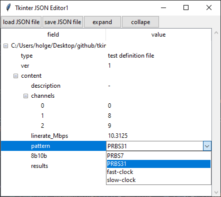

# tkinter_json_editor
Load JSON content into a tkinter GUI for viewing and editing

# Editor1
Editor1 fullfils already most requirements and looks as follows:

## Pros - what Editor1 can do
- ... 
- ...

## Cons - why there is Editor2
- ...

## References
Editor1 is inspired by:
- [PyJSONViewer](https://github.com/AtsushiSakai/PyJSONViewer), well programmed but viewing only.
- [tkinter-json-editor](https://github.com/zargit/tkinter-json-editor), includes cell editing, though awkward 
- [ttk.Treeview with Entry widgit for cell editing](https://www.youtube.com/watch?v=n5gItcGgIkk) 
